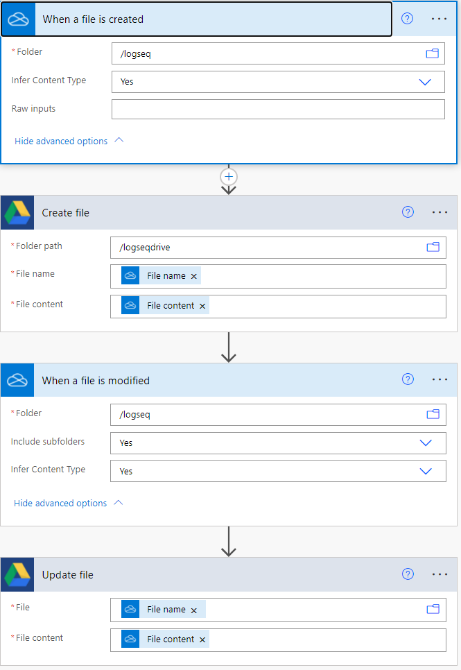

- [Formative assessment, growth mindset, and achievement: examining their relations in the East and the West](https://www.tandfonline.com/doi/full/10.1080/0969594X.2021.1988510) #openaccess #reference
	- [[Formative assessment]], [[Growth mindset]], [[Reading]], [[Secondary education]], [[Self-regulated learning]]
	- >The results showed that formative assessment strategies were positively, albeit weakly, related to a growth mindset in the East, but not in the West. In contrast, growth mindset was positively related to reading achievement only in the West, but not in the East. The impacts of different formative assessment strategies on reading achievement demonstrated cross-cultural variability, but the strongest positive predictor was instructional adjustments.
- [The power of internal feedback: exploiting natural comparison processes](https://www.tandfonline.com/doi/full/10.1080/02602938.2020.1823314) #openaccess #reference
	- [[Feedback]]
	- Follow-up keynote video: {{vimeo https://player.vimeo.com/video/654039642?h=6685b01d6a}}
- [[Logseq]] mobile app - [[Android]] beta: https://github.com/logseq/logseq/releases/tag/mobile-0.1
- Using [[Logseq]] across multiple devices:
	- Use FolderSync or other apps on mobile to sync files to the cloud
		- You might be blocked from connecting FolderSync to work accounts such as OneDrive
		- Workaround: sync [[OneDrive]] to [[Google Drive]] using Microsoft's [[Power Automate]], which in turn can be synced to a local folder on your android device using the FolderSync app: 