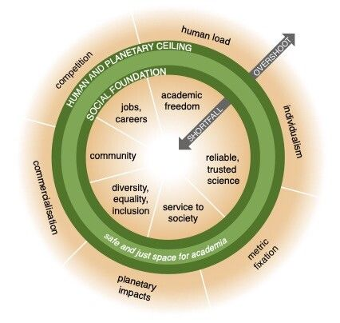

- [Firefox stops working on progressive web app support](https://www.fastcompany.com/90597411/mozilla-firefox-no-ssb-pwa-support)
	- [[PWA]], [[Firefox]], [[Web browser]]
	- [How to Enable the Site-Specific Browser (SSB) in Firefox - Make Tech Easier](https://www.maketecheasier.com/enable-site-specific-browser-firefox/)
	- [Enable Site Specific Browser (SSB) Mode in Firefox - Windows Bulletin Tutorials](https://windowsbulletin.com/enable-site-specific-browser-ssb-mode-in-firefox/)
	- [You can still install and use PWAs in Firefox browser, thanks to this Extension](https://techdows.com/2021/09/install-pwas-firefox-desktop.html)
	- [filips123/PWAsForFirefox: A tool to install, manage and use Progressive Web Apps (PWAs) in Mozilla Firefox](https://github.com/filips123/PWAsForFirefox)
- [The role of teachers in a sustainable university: from digital competencies to postdigital capabilities | SpringerLink](https://link.springer.com/article/10.1007/s11423-023-10199-z)
	- [[Sustainable teaching]], [[Sustainable development goal]]
- [Point of View: Rethinking academia in a time of climate crisis | eLife](https://elifesciences.org/articles/84991)
	- [[Climate change education]], [[Academia]], [[Higher education reform]], [[Neoliberalism in higher education]], [[Economics]]
	- 
- [ReSpec Writing](https://inkdroid.org/2023/05/13/respec/)
	- [[Archive]], [[Markdown]]
	- https://inkdroid.org/2023/05/13/respec/
	- [webrecorder/markdown-to-respec: A Github Action for turning Markdown into ReSpec HTML](https://github.com/webrecorder/markdown-to-respec)
- [Global Warming and Climate Change skepticism examined](https://skepticalscience.com/)
	- [[Climate change education]], [[Denialism]], [[Misinformation]], [[Counter-narrative]]
- [A Generative AI Primer - National centre for AI](http://nationalcentreforai.jiscinvolve.org/wp/2023/05/11/generative-ai-primer/)
	- [[Artificial intelligence in education]], [[ChatGPT]]
- [Means. Motive, Opportunity: A Composite Narrative about Academic Misconduct - National centre for AI](https://nationalcentreforai.jiscinvolve.org/wp/2023/03/27/means-motive-opportunity-a-composite-narrative-about-academic-misconduct/)
	- [[Cheating]], [[Academic Integrity]]
- [How to write in plain English](https://www.plainenglish.co.uk/how-to-write-in-plain-english.html)
	- [[Plain language]]
- [Full article: Conceptualising responsibility and hostility within work-integrated learning placements for students with disabilities](https://www.tandfonline.com/eprint/ZVGPNJHPX65HRTU655BS/full?target=10.1080/09687599.2023.2209276)
	- [[Work-integrated learning]], [[Students with disabilities]], [[Inclusive access]], [[Psychological safety]], [[Accommodations]], [[Equity]], [[Employability]]
- https://github.com/sissbruecker/linkding
	- [[Bookmark]], [[Archive]], [[Social bookmarking]], [[Open source]]
- [Undergraduate students’ approaches to learning biology: a systematic review of the literature](https://www.tandfonline.com/doi/full/10.1080/03057267.2021.2004005)
	- [[Biology education]], [[Systematic review]]
	- https://jewlscholar.mtsu.edu/server/api/core/bitstreams/a4635012-db01-4db8-91c8-732f45f84952/content
- [Engaging Students Asynchronously with Interactive Videos | Faculty Focus](https://www.facultyfocus.com/articles/online-education/online-course-delivery-and-instruction/engaging-students-asynchronously-with-interactive-videos/?st=FFdaily%3Bsc%3DFF230515%3Butm_term%3DFF230515&mailingID=4889&vgo_ee=rhKip2TBSqN%2B%2FlFJ2iYe8UKhWLCKrkEf6vJDerRc8UENSW7gtQ%3D%3D%3A4942ilktoRDG9hjTPnO%2F%2BKhwVYFLdXIV)
	- [[Interactive video]], [[Student engagement]]
- [Everyone hates Elsevier](https://freethoughtblogs.com/pharyngula/2023/05/15/everyone-hates-elsevier/)
	- [[Academic publishing]], [[Research journal]]
- [PsyArXiv Preprints | A systematic review and natural language processing-based integration of the structure of core beliefs across fields](https://psyarxiv.com/ky4vu/)
	- [[Beliefs]], [[Systematic review]]
- [Embracing ChatGPT: A Teacher’s Tool - EdTech Digest](https://www.edtechdigest.com/2023/05/03/embracing-chatgpt-a-teachers-tool/)
	- [[ChatGPT]], [[Teaching]], [[Artificial intelligence in education]]
- [OpenLearning - AI Assistant](https://solutions.openlearning.com/ai-assistant)
	- [[Artificial intelligence in education]], [[Custom GPT]], [[Learning Design]], [[Elearning authoring]]
- [International Handbook of Engineering Education Research | Aditya Johr](https://www.taylorfrancis.com/books/oa-edit/10.4324/9781003287483/international-handbook-engineering-education-research-aditya-johri)
	- [[Engineering education]], [[Ebook]], [[Open access]]
- [custom bot](https://custombot.ai/)
	- [[Chatbot]], [[Artificial intelligence]], [[ChatGPT]], [[LlamaIndex]]
- [Faculty members’ use of artificial intelligence to grade student papers: a case of implications | International Journal for Educational Integrity | Full Text](https://edintegrity.biomedcentral.com/articles/10.1007/s40979-023-00130-7)
	- [[ChatGPT]], [[Grading]], [[Academic Integrity]], [[Artificial intelligence in education]]
-