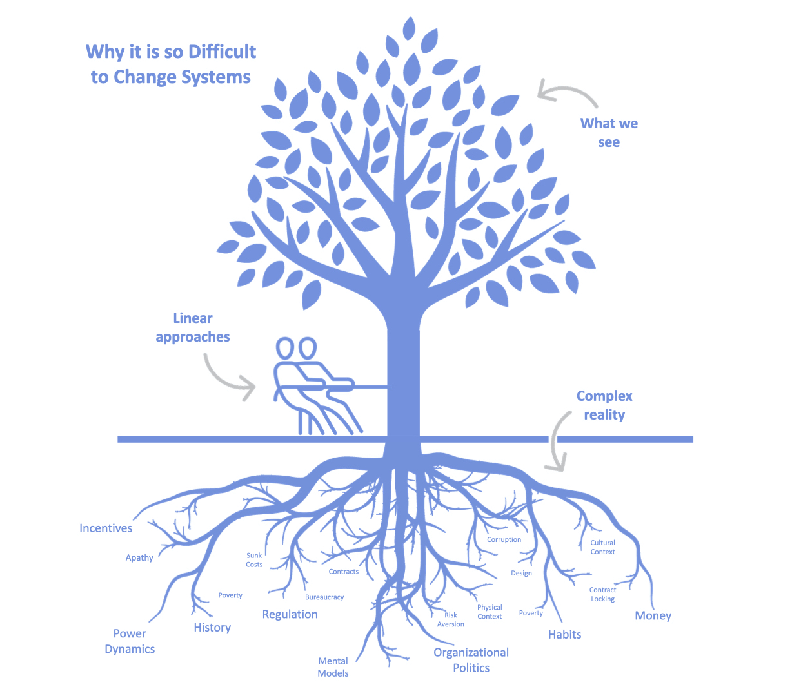

- [Pragmatism, by William James](https://standardebooks.org/ebooks/william-james/pragmatism)
	- [[Pragmatism]]
- [The Public and Its Problems, by John Dewey](https://standardebooks.org/ebooks/john-dewey/the-public-and-its-problems)
	- [[Democratic education]], [[Purpose of education]], [[Economics]]
- [How the strange idea of ‘statistical significance’ was born](https://www.sciencenews.org/article/statistical-significance-p-value-null-hypothesis-origins)
	- [[Statistical Significance]], [[Statistics]], [[Physics envy]]
- [Preparing Math Teachers: What's in the Coursework?](https://www.edweek.org/teaching-learning/preparing-math-teachers-whats-in-the-coursework/2023/09)
	- [[Mathematics education]], [[Professional development]], [[Evidence-based Teaching]], [[What works]], [[Math wars]], [[Research practice gap]], [[Applying educational research]], [[Applying psychology to education]], [[Productive failure]]
	- [WWC | Practice Guides](https://ies.ed.gov/ncee/wwc/practiceguides)
- [Graphic Kits | Graphic Kit](https://www.systemsinnovation.network/spaces/12188592/page)
	- [[Systems thinking]], [[Infographic]]
	- **04:24** [[quick capture]]: 
- [sqlcoder](https://ollama.ai/library/sqlcoder)
	- [[SQL]], [[Natural language processing]], [[LLM]], [[Open source]], [[Open LLM]]
- [Running Python micro-benchmarks using the ChatGPT Code Interpreter alpha](https://simonwillison.net/2023/Apr/12/code-interpreter/)
	- [[ChatGPT]], [[Coding]], [[Code generation]], [[Data Science]]
- [Llama from scratch (or how to implement a paper without crying) | Brian Kitano](https://blog.briankitano.com/llama-from-scratch/)
	- [[LLM]], [[Open LLM]]
- [Runway - Advancing creativity with artificial intelligence.](https://runwayml.com/)
	- [[Video generation]]
- [Curated Teaching Initiative Repository](https://ascnhighered.org/ASCN/evaluation_initiatives/repository.html)
	- [[Evaluating teaching]], [[Teaching excellence]]
-