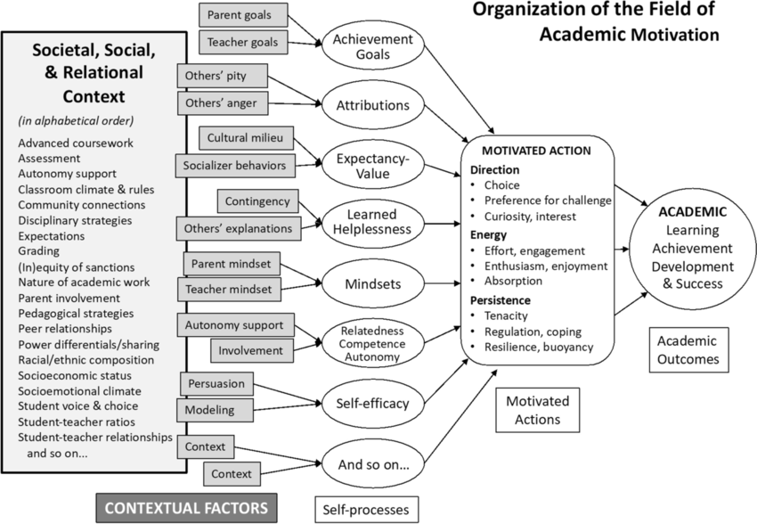

- [Full article: Searching students’ reflective writing for linguistic correlates of their tendency to ignore instructors’ feedback](https://www.tandfonline.com/doi/full/10.1080/0969594X.2024.2332267)
	- [[Feedback]], [[Teacher feedback]], [[feedback literacy]], [[Grades]]
- [Being Neurodivergent in Academia | Collections | eLife](https://elifesciences.org/collections/73e48266/being-neurodivergent-in-academia)
	- [[Neurodiversity]]
- [XAgent: An Autonomous Agent for Complex Task Solving | XAgent](https://blog.x-agent.net/blog/xagent/)
	- [[AI agents]], [[API]], [[Human in the loop]], [[Asking questions]]
	- [OpenBMB/XAgent: An Autonomous LLM Agent for Complex Task Solving](https://github.com/OpenBMB/XAgent)
	- [OpenBMB/ToolBench: [ICLR'24 spotlight] An open platform for training, serving, and evaluating large language model for tool learning.](https://github.com/OpenBMB/ToolBench)
	- [XAgent Blog](https://blog.x-agent.net/)
	- [XAgent/assets/tasks.yml at main · OpenBMB/XAgent](https://github.com/OpenBMB/XAgent/blob/main/assets/tasks.yml)
- [allenai/MacGyver: Code and Data for the NAACL 24 paper: MacGyver: Are Large Language Models Creative Problem Solvers?](https://github.com/allenai/MacGyver)
	- [[LLM]], [[Problem solving]]
- [zorazrw/awesome-tool-llm](https://github.com/zorazrw/awesome-tool-llm)
	- [[LLM]], [[tool calling]]
	- [[2403.15452] What Are Tools Anyway? A Survey from the Language Model Perspective](https://arxiv.org/abs/2403.15452)
- [bracesproul/langtool-template](https://github.com/bracesproul/langtool-template/tree/main)
	- [[LLM]], [[API]], [[AI agents]], [[tool calling]]
	- Building ToolLLM With LangGraph.js - YouTube video https://m.youtube.com/watch?v=xbZzJjBm6t4
	- [langchain-ai/langgraphjs: ⚡ Build language agents as graphs ⚡](https://github.com/langchain-ai/langgraphjs/tree/main)
	- [[2402.04253] AnyTool: Self-Reflective, Hierarchical Agents for Large-Scale API Calls](https://arxiv.org/abs/2402.04253)
- [An endless cycle of ignorance is the consequence of not offering classes on IQ and human intelligence - ScienceDirect](https://www.sciencedirect.com/science/article/abs/pii/S0160289624000217)
	- [[Intelligence]], [[Myths about psychology]], [[Knowledge]], [[Beliefs about learning]]
- [Beyond the binary: the humanities and sciences in conversation](https://www.insidehighered.com/opinion/blogs/higher-ed-gamma/2024/03/20/beyond-binary-humanities-and-sciences-conversation)
	- [[Humanities]], [[Scientism]]
- [Four Guideposts toward an Integrated Model of Academic Motivation: Motivational Resilience, Academic Identity, Complex Social Ecologies, and Development | Educational Psychology Review](https://link.springer.com/article/10.1007/s10648-023-09790-w)
	- [[Motivation]], [[Student motivation]], [[Academic identity]], [[Resilience]], [[Learning ecology]]
	- [A schematic of the field of academic motivation showing that (1)... | Download Scientific Diagram](https://www.researchgate.net/figure/A-schematic-of-the-field-of-academic-motivation-showing-that-1-current-theories-are_fig1_365698977)
	- [Theories of motivation: Integration and ways forward | Request PDF](https://www.researchgate.net/publication/341511904_Theories_of_motivation_Integration_and_ways_forward)
	- [[quick capture]]: 
- [Codium-ai/AlphaCodium: Official implementation for the paper: "Code Generation with AlphaCodium: From Prompt Engineering to Flow Engineering""](https://github.com/Codium-ai/AlphaCodium)
	- [[Code generation]], [[Flow engineering]], [[langchain]]
	- [Why CodiumAI Could Pass Four Tests for a High Potential Startup | Inc.com](https://www.inc.com/peter-cohan/why-codiumai-could-pass-four-tests-for-a-high-potential-startup.html)
- [Flow Engineering is All You Need. We’re pushing the boundaries of what’s… | by Rohan Balkondekar | Feb, 2024 | Medium](https://medium.com/@rohanbalkondekar/flow-engineering-is-all-you-need-9046a5e7351d)
	- [[Flow engineering]]
- [Building a Math Application with LangChain Agents | by Tahreem Rasul | Mar, 2024 | Towards Data Science](https://towardsdatascience.com/building-a-math-application-with-langchain-agents-23919d09a4d3)
	- [[langchain]], [[Intelligent tutoring system]], [[Mathematics education]], [[AI agents]], [[Flow engineering]]
-