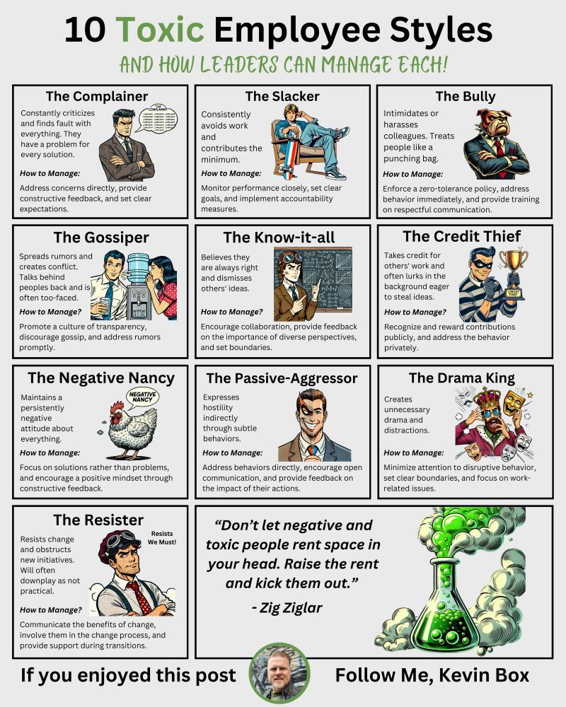

- [Students and professors expect more cheating thanks to AI](https://www.insidehighered.com/news/tech-innovation/artificial-intelligence/2024/07/29/students-and-professors-expect-more)
	- [[Cheating]], [[Artificial intelligence in education]], [[Student perception]], [[Faculty perception]]
- [ssciwr/vink: A stand-alone application with GUI for OpenAI's Whisper](https://github.com/ssciwr/vink)
	- [[Whisper]], [[Desktop app]], [[Windows]]
- [OATutor: An Open-source Adaptive Tutoring System and Curated Content Library for Learning Sciences Research | Proceedings of the 2023 CHI Conference on Human Factors in Computing Systems](https://dl.acm.org/doi/10.1145/3544548.3581574)
	- [[Intelligent tutoring system]], [[Open source]], [[OpenAI]], [[Artificial intelligence in education]]
	- [Leveraging AI to improve adaptive tutoring systems | Berkeley School of Education](https://bse.berkeley.edu/leveraging-ai-improve-adaptive-tutoring-systems)
	- https://youtu.be/1_dR9mSICNU?si=JVAbbja3MFXBCeR5
	- [OATutor Canvas integration](https://cahlr.github.io/OATutor/#/posts/set-up-canvas-integration)
		- [[Canvas]], [[LTI]]
		- [OATutor canvas assignments](https://cahlr.github.io/OATutor/#/posts/canvas-assignments)
- [Home | Terracotta](https://www.terracotta.education/)
	- [[Open source]], [[Educational Technology]], [[Canvas]],, [[LTI]], [[Research tools]], [[Early alert]], [[Experimental research platform]], [[Scholarship of teaching and learning]]
	- [terracotta-education/terracotta: Terracotta (a portmanteau of Tool for Education Research with RAndomized COnTrolled TriAls) is a plug-in to the learning management system that allows the contents of online assignments to be differentiated for experimental treatment variations, and to be assigned randomly to different groups of students. Terracotta also enables privacy protections for student participants, such as informed consent that is hidden from the teacher, filtering of non-consenting participants from result summaries and data exports, and removal of student identifiers from these exports. Terracotta's goal is to lower the technical and methodological barriers to conducting more rigorous and responsible education research.](https://github.com/terracotta-education/terracotta)
- [Eedi for Teachers](https://eedi.com/us)
	- [[Artificial intelligence in education]], [[Formative assessment]], [[Misconception]]
- [Home | Quandary](https://www.quandarygame.org/)
	- [[Game]], [[Game-based learning]], [[Ethics]]
- [Artificial Intelligence with MIT App Inventor](https://appinventor.mit.edu/explore/ai-with-mit-app-inventor)
	- [[Artificial intelligence in education]], [[AI literacy]]
- [Curio AI Tutor](https://curioai.co/)
	- [[AI assistant]], [[Artificial intelligence in education]]
- [AIphabet Home - Brand](https://aiphabet.org/mobile_index.html)
	- [[AI literacy]]
- [About Kolibri - Learning Equality](https://learningequality.org/kolibri/about-kolibri/)
	- [[Offline learning]], [[LMS]], [[Open source]], [[Local first software]]
	- [learningequality/kolibri: Kolibri Learning Platform: the offline app for universal education](https://github.com/learningequality/kolibri)
- [Mapping the Landscape of AI-Powered Nonprofits](https://ssir.org/articles/entry/ai-powered-nonprofits-landscape#)
	- [[Non-profit]], [[Artificial intelligence]]
- [KiwiWrite Math: Helping Students with Dysgraphia Succeed](https://www.kiwiwrite.com/)
	- [[Mathematics education]], [[handwriting]], [[OCR]], [[Accessibility]]
- [Customizing Students' Learning Experiences while Designing an Online Course | International Journal of Designs for Learning](https://scholarworks.iu.edu/journals/index.php/ijdl/article/view/19180)
	- [[Experiential learning]], [[Online teaching]], [[Personalized learning]], [[Course design]]
- [[quick capture]]: 
	- [[Toxic workplace]]
- [My favourite tool is this notebook I made | Writing Slowly](https://writingslowly.com/2024/07/29/my-favourite-tool.html)
	- [[TiddlyWiki]], [[Personal knowledge management]], [[Project Management]]
- [Media Bias/Fact Check - Search and Learn the Bias of News Media](https://mediabiasfactcheck.com/)
	- [[Bias in media]], [[Information literacy]], [[Misinformation]], [[Social media]], [[Journalism]], [[News]]
	- [Breaking News Headlines and Media Bias | Ground News](https://ground.news/)
- [Akansha Saxena | Build Smart Drupal Chatbots with RAG Integration and Ollama](https://akanshasaxena.com/post/drupal-rag-integration/)
	- [[Drupal]], [[Retrieval augmented generation]], [[Chatbot]], [[Local AI]], [[Open LLM]]
	- [saxenaakansha30/drupal-rag-integration-module: Drupal module for RAG App integration](https://github.com/saxenaakansha30/drupal-rag-integration-module)
- [Deschooling AI](https://danmcquillan.org/deschooling_ai_abstract.html)
	- [[Artificial intelligence in education]], [[Neoliberalism in education]]
- [How Big Tech Manipulates Academia to Avoid Regulation](https://theintercept.com/2019/12/20/mit-ethical-ai-artificial-intelligence/)
	- [[Artificial intelligence Ethics]]
- [How to De-Google your life – The ultimate list of best Google alternatives.](https://tuta.com/blog/how-to-leave-google-gmail)
	- [[Google]], [[Open source]]
- [Cutting-Edge AI for Education at the Edge | by Jamie Alexandre | Learning Equality](https://blog.learningequality.org/cutting-edge-ai-for-education-at-the-edge-8d3d8794fdbd)
	- [[Artificial intelligence in education]]
- [MLC | GPU-Accelerated LLM on a $100 Orange Pi](https://blog.mlc.ai/2024/04/20/GPU-Accelerated-LLM-on-Orange-Pi)
	- [[Open LLM]], [[Offline learning]], [[Local AI]]
- [Choosing to learn: The importance of student autonomy in higher education | Science Advances](https://www.science.org/doi/10.1126/sciadv.ado6759)
	- [[Autonomy-supportive teaching]], [[Student agency]], [[Autonomy]], [[STEM education]], [[Attendance]], [[Achievement]], [[Student motivation]]
-